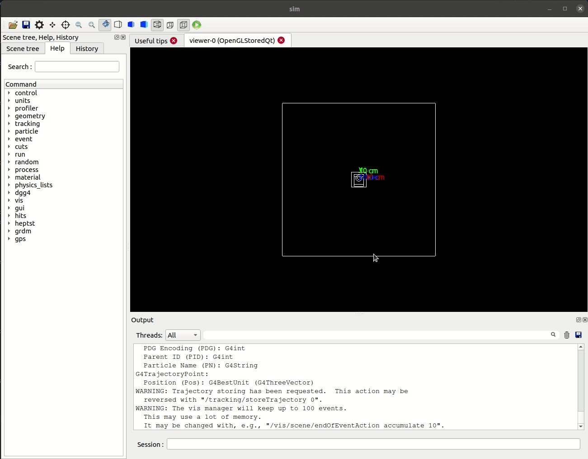

# Dynamic Geometry Geant4 Example #

This is an example of a Geant4 simulation that employs dynamically-modifiable
geometry via UI commands, rather than having to re-run the application. The
user may input a number of geometry changes, then call `/dgg4/geometry/update`
to update it, which works from either a .mac file or the visualization. These
commands can be run _after `/run/initialize` is called_, instead of having to
do so beforehand! Here is a .gif showing the program switching between the
Geant4-provided example B1 and B3 geometries.

Behind the scenes, the geometry is deleted and rebuilt from scratch. Then the
sensitive detectors are re-attached from their respective threads to whatever
logical volumes they map to.

This code is intended to be a teaching example/demo as a follow-up to the
[NE697: Introduction to Geant4](https://github.com/micahfolsom/ne697-lectures)
course I taught at University of Tennessee, Knoxville in Fall 2021.

## Adding a Geometry ##

A `Geometry` is defined as everything in the simulation, minus the outermost
volume (the "world" or "experimental hall"). The `BaseGeometry` class is
available for creating new geometries. Inherit from this class and override
the `build(G4LogicalVolume*)` function, which should contain the code that
commonly goes into `DetectorConstruction::Construct()`: allocation of G4Solids,
G4LogicalVolumes, and G4PVPlacements, etc.

Once your `*Geometry` class is defined, modify `DetectorConstruction` to create
the new object on construction and add an `else if` case for it in the
`Construct()` function. Finally, add the name to the list of available
Geometries in `detectorconstruction.cpp`. This is the minimum required to make
it available - you must also add commands to `GeometryMessenger` to modify its
properties.

## UI Commands ##

`/dgg4/run/save_data` 
Description: toggle saving hit data to disk 
Argument: `true false` 
Default: false 

`/dgg4/run/save_path` 
Description: set the path of the output data file 
Argument: path 
Default: hits.h5 

`/dgg4/geometry/update` 
Description: update/reload/reinitialize the geometry 
Argument: none 

`/dgg4/geometry/select` 
Description: choose which geometry to use 
Argument: `example1 example3` 
Default: example1 

## Output Data ##

Data is output as HDF5, `.h5`, where each attribute of the `Hit` is a dataset.

## Dependencies ##

Besides Geant4, this requires [HDF5](https://portal.hdfgroup.org/display/HDF5).
`sudo apt install libhdf5-dev` on Ubuntu.
